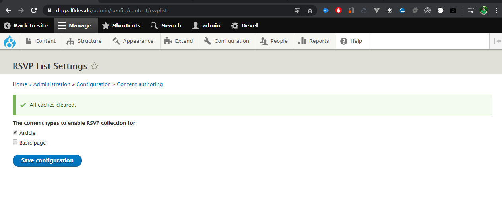
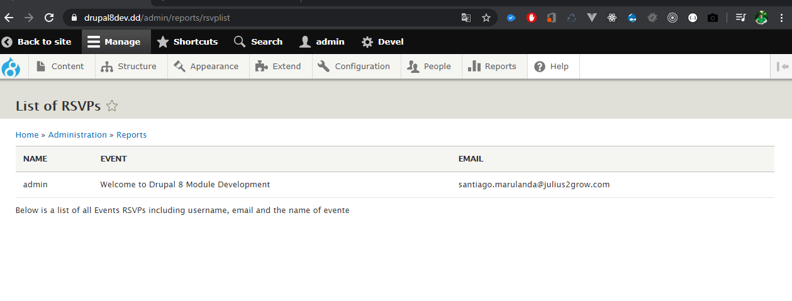
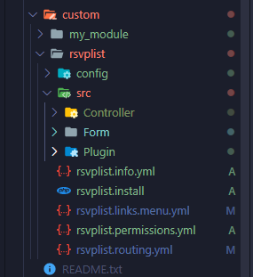

# DRUPAL DEVELOPMENT COURSE - ACQUIA CERTIFICATION

This project is code of practical course Drupal 8 development and is a part of preparation por Acquia Site Builder Certification,

## PRACTICE

- Module development
  - Controller
  - Form
  - Config Form
  - Blocks
  - hooks
  - Condig schema API
  - routing
  - permissions

## SCREENSHOTS

## LICENCE 

MIT
